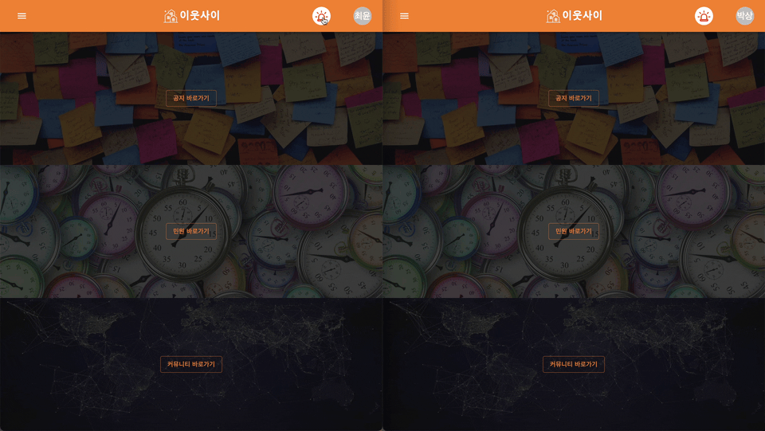

# AN-frontend

## 1. 소개


> 소중한 이웃과 함께하는 이웃사이

이웃사이는 나와 가장 가까운 이웃간의 사소하지만 소중한 가치들을 공유할 수 있는 인프라를 형성하고자 출시한 서비스 입니다.

<br>

## 2. 사용 방법

### **git clone**

```shell
$ git clone https://github.com/among-neighbors/AN-frontend.git
```

### 빌드 파일 생성

```
$ cd AN-frontend/client
$ npm install
$ npm run build
```

### docker-compose 파일 실행을 위한 VM 파일 디렉토리

```
home
├── AN-frontend
├── AN-frontend-manager
├── AN-frontend-builtin
└── Dockerfile
    ├── data
    ├── application.yml
    └── default.conf
```

이때, Dockerfile 내 data는 certbot을 통한 ssl data입니다.

### docker-compose 파일 실행

```
$ cd Dockerfile
$ docker-compose -f application.yml up -d
```

docker-compose 설치가 되어있어야 합니다.

<details>
<summary>application.yml</summary>
<div markdown="1">

```yaml
version: "3"
services:
  nginx:
    image: nginx:latest
    restart: unless-stopped
    volumes:
      - ./default.conf:/etc/nginx/conf.d/default.conf
      - ./data/certbot/conf:/etc/letsencrypt
      - ./data/certbot/www:/var/www/certbot
      - ../AN-frontend/client/dist:/usr/share/nginx/user
      - ../AN-frontend-manager/client/dist:/usr/share/nginx/manager
      - ../AN-frontend-builtin/client/dist:/usr/share/nginx/builtin
    ports:
      - 80:81
      - 443:443
  certbot:
    image: certbot/certbot
    restart: unless-stopped
    volumes:
      - ./data/certbot/conf:/etc/letsencrypt
      - ./data/certbot/www:/var/www/certbot
```

</div>
</details>

<details>
<summary>default.conf</summary>
<div markdown="1">

```nginx
server {
    listen       81;
    listen       [::]:81;
    server_name  www.neighbor42.com;
    # access_log /var/log/nginx/local.access.log main;

    location /.well-known/acme-challenge/ {
        allow all;
        root /var/www/certbot;
     }

     location / {
         return 301 https://$host$request_uri;
     }

}

server {
    listen  443 ssl;
    listen  [::]:443 ssl;
    server_name www.neighbor42.com;

    ssl_certificate /etc/letsencrypt/live/www.neighbor42.com/fullchain.pem;
    ssl_certificate_key /etc/letsencrypt/live/www.neighbor42.com/privkey.pem;
    include /etc/letsencrypt/options-ssl-nginx.conf;
    ssl_dhparam /etc/letsencrypt/ssl-dhparams.pem;

    location / {
        proxy_pass  http://localhost:80/user;
        proxy_set_header    Host                $http_host;
        proxy_set_header    X-Real-IP           $remote_addr;
        proxy_set_header    X-Forwarded-For     $proxy_add_x_forwarded_for;
    }

    location ^~ /manager {
        proxy_pass  http://localhost:80/manager;
        proxy_set_header    Host                $http_host;
        proxy_set_header    X-Real-IP           $remote_addr;
        proxy_set_header    X-Forwarded-For     $proxy_add_x_forwarded_for;
    }

    location ^~ /builtin {
        proxy_pass  http://localhost:80/builtin;
        proxy_set_header    Host                $http_host;
        proxy_set_header    X-Real-IP           $remote_addr;
        proxy_set_header    X-Forwarded-For     $proxy_add_x_forwarded_for;
    }

}

server {
    listen       80;
    listen       [::]:80;
    server_name  localhost;

     location /user {
        alias  /usr/share/nginx/user/;
        index  index.html index.htm;
        try_files   $uri $uri/ /user/index.html;
        sub_filter ../public/img ../img;
        sub_filter_once off;
        sub_filter_types *;
    }
    location /manager {
        alias  /usr/share/nginx/manager/;
        index  index.html index.htm;
        try_files   $uri $uri/ /manager/index.html;
        sub_filter ../public/img ../manager/img;
        sub_filter /assets/ /manager/assets/;
        sub_filter_once off;
        sub_filter_types *;
    }
    location /builtin {
        alias  /usr/share/nginx/builtin/;
        index  index.html index.htm;
        try_files   $uri $uri/ /builtin/index.html;
        sub_filter ../public/img ../builtin/img;
        sub_filter ../public/model ../builtin/model;
        sub_filter /assets/ /builtin/assets/;
        sub_filter_once off;
        sub_filter_types *;
    }
}
```

</div>
</details>

<br>

## 3. 기능

> 어디서든 누구나 편하게 이용해요.

이웃사이는 **휴대용 기기와 빌트인 기기 간의 인터페이스** 다각화를 통해서 가장 효과적인 접근 방식을 제공합니다.

웹 서비스로 집 밖에서도 이웃 사이를 이용하고, 편리하게 글을 작성할 수 있습니다.

집 안에서는 **얼굴 인식 기반 연령 별로 제공되는 맞춤형 인터페이스**로 남녀노소 누구나 편리하게 빌트인 기기를 사용할 수 있습니다.

<br>


<p>


</p>
&nbsp;&nbsp;&nbsp;&nbsp;&nbsp;&nbsp;&nbsp;&nbsp;&nbsp;&nbsp;&nbsp;&nbsp;&nbsp;&nbsp;&nbsp;&nbsp;&nbsp;&nbsp;&nbsp;&nbsp;&nbsp;&nbsp;&nbsp;&nbsp;&nbsp;&nbsp;&nbsp;&nbsp;&nbsp;&nbsp;<빌트인 일반 사용자 모드>&nbsp;&nbsp;&nbsp;&nbsp;&nbsp;&nbsp;&nbsp;&nbsp;&nbsp;&nbsp;&nbsp;&nbsp;&nbsp;&nbsp;&nbsp;&nbsp;&nbsp;&nbsp;&nbsp;&nbsp;&nbsp;&nbsp;&nbsp;&nbsp;&nbsp;&nbsp;&nbsp;&nbsp;&nbsp;&nbsp;&nbsp;&nbsp;&nbsp;&nbsp;&nbsp;&nbsp;&nbsp;&nbsp;&nbsp;&nbsp;&nbsp;&nbsp;&nbsp;&nbsp;&nbsp;&nbsp;&nbsp;&nbsp;&nbsp;<어르신 모드>
<br>
<br>

> 프로필을 통해 나를 드러낼 수 있어요.

이웃사이 웹 서비스는 프로필 로그인을 통해 본인을 드러내어 이웃과 소통할 수 있습니다.

<p>

</p>
&nbsp;&nbsp;&nbsp;&nbsp;&nbsp;&nbsp;&nbsp;&nbsp;&nbsp;&nbsp;&nbsp;&nbsp;&nbsp;&nbsp;&nbsp;&nbsp;&nbsp;&nbsp;&nbsp;&nbsp;&nbsp;&nbsp;&nbsp;&nbsp;&nbsp;&nbsp;&nbsp;&nbsp;&nbsp;&nbsp;<웹 사용자 모드>

> 이웃 사이 조금 더 편하게 이야기 할 수 있어요.

이웃사이는 이웃 간 조금은 더 편하게 다가갈 수 있는 온라인 소통 창구를 제공합니다.

**커뮤니티**를 통해 이웃과 공유할 글을 작성할 수 있고, **댓글**로 소통할 수 있습니다.

**민원** 사항도 관리실에 방문하지 않고 온라인으로 편리하게 요청하고, 처리결과를 알 수 있습니다.

<br>

<p>


</p>
&nbsp;&nbsp;&nbsp;&nbsp;&nbsp;&nbsp;&nbsp;&nbsp;&nbsp;&nbsp;&nbsp;&nbsp;&nbsp;&nbsp;&nbsp;&nbsp;&nbsp;&nbsp;&nbsp;&nbsp;&nbsp;&nbsp;&nbsp;&nbsp;&nbsp;&nbsp;&nbsp;&nbsp;&nbsp;&nbsp;<빌트인 일반 사용자 모드>&nbsp;&nbsp;&nbsp;&nbsp;&nbsp;&nbsp;&nbsp;&nbsp;&nbsp;&nbsp;&nbsp;&nbsp;&nbsp;&nbsp;&nbsp;&nbsp;&nbsp;&nbsp;&nbsp;&nbsp;&nbsp;&nbsp;&nbsp;&nbsp;&nbsp;&nbsp;&nbsp;&nbsp;&nbsp;&nbsp;&nbsp;&nbsp;&nbsp;&nbsp;&nbsp;&nbsp;&nbsp;&nbsp;&nbsp;&nbsp;&nbsp;&nbsp;&nbsp;&nbsp;&nbsp;&nbsp;&nbsp;&nbsp;&nbsp;&nbsp;<어르신 모드>
<br>
<br>

> 이웃 사이 중요한 정보는 놓치면 안돼요.

이웃사이는 집 안팎에서 언제든지 확인 가능한 통합 공지 시스템을 제공합니다.

언제 어디서든 **공지사항**을 간편하게 확인할 수 있습니다. 세대 별 공지를 골라 볼 수도 있습니다.

<br>

<p>


</p>
&nbsp;&nbsp;&nbsp;&nbsp;&nbsp;&nbsp;&nbsp;&nbsp;&nbsp;&nbsp;&nbsp;&nbsp;&nbsp;&nbsp;&nbsp;&nbsp;&nbsp;&nbsp;&nbsp;&nbsp;&nbsp;&nbsp;&nbsp;&nbsp;&nbsp;&nbsp;&nbsp;&nbsp;&nbsp;&nbsp;<빌트인 일반 사용자 모드>&nbsp;&nbsp;&nbsp;&nbsp;&nbsp;&nbsp;&nbsp;&nbsp;&nbsp;&nbsp;&nbsp;&nbsp;&nbsp;&nbsp;&nbsp;&nbsp;&nbsp;&nbsp;&nbsp;&nbsp;&nbsp;&nbsp;&nbsp;&nbsp;&nbsp;&nbsp;&nbsp;&nbsp;&nbsp;&nbsp;&nbsp;&nbsp;&nbsp;&nbsp;&nbsp;&nbsp;&nbsp;&nbsp;&nbsp;&nbsp;&nbsp;&nbsp;&nbsp;&nbsp;&nbsp;&nbsp;&nbsp;&nbsp;&nbsp;&nbsp;<어르신 모드>
<br>
<br>

> 이웃 사이 골든타임을 지켜줄 수 있어요.

이웃사이는 사용자가 위급한 상황에서 관리실 및 이웃에게 신속하게 도움을 요청할 수 있는 기능을 제공합니다.

**도움을 요청**하는 즉시 같은 라인의 모든 이웃들에게 전달되고, 요청을 수락한 이웃으로부터 필요한 도움을 받을 수 있습니다.

<br>

<p>


</p>
&nbsp;&nbsp;&nbsp;&nbsp;&nbsp;&nbsp;&nbsp;&nbsp;&nbsp;&nbsp;&nbsp;&nbsp;&nbsp;&nbsp;&nbsp;&nbsp;&nbsp;&nbsp;&nbsp;&nbsp;&nbsp;&nbsp;&nbsp;&nbsp;&nbsp;&nbsp;&nbsp;&nbsp;&nbsp;&nbsp;<웹 사용자 모드>

<p>


</p>
&nbsp;&nbsp;&nbsp;&nbsp;&nbsp;&nbsp;&nbsp;&nbsp;&nbsp;&nbsp;&nbsp;&nbsp;&nbsp;&nbsp;&nbsp;&nbsp;&nbsp;&nbsp;&nbsp;&nbsp;&nbsp;&nbsp;&nbsp;&nbsp;&nbsp;&nbsp;&nbsp;&nbsp;&nbsp;&nbsp;<빌트인 일반 사용자 모드>&nbsp;&nbsp;&nbsp;&nbsp;&nbsp;&nbsp;&nbsp;&nbsp;&nbsp;&nbsp;&nbsp;&nbsp;&nbsp;&nbsp;&nbsp;&nbsp;&nbsp;&nbsp;&nbsp;&nbsp;&nbsp;&nbsp;&nbsp;&nbsp;&nbsp;&nbsp;&nbsp;&nbsp;&nbsp;&nbsp;&nbsp;&nbsp;&nbsp;&nbsp;&nbsp;&nbsp;&nbsp;&nbsp;&nbsp;&nbsp;&nbsp;&nbsp;&nbsp;&nbsp;&nbsp;&nbsp;&nbsp;&nbsp;&nbsp;&nbsp;<어르신 모드>
<br>
<br>

## 4. 이웃사이 클라이언트 환경

> 이웃사이 서버는 이렇게 개발하고 배포해요

본 프로젝트를 사용해서 이웃사이가 어떻게 서버를 구성하였는지 설명합니다.

<br>

### **기술 스택**


자세한 적용 방식은 [이웃사이 기술포스팅](https://gratis-shape-ac1.notion.site/fa9b8f0cddc047c99bef0dbc126b00d3?v=aa3acf9a163146a7ba342d5a5010fdac)
에서 확인할 수 있습니다.

<br>

### **개발 및 배포 환경**

**CI/CD**

이웃사이 서버에서는 CI/CD 환경을 구축하여 클라이언트에게 실시간으로 변경사항을 반영하고 배포과정에서 발생하는 시간 및 비용을 최소화 합니다.


<br>

**런타임 애플리케이션**

런타임 환경은 Nginx 도커 컨테이너를 통해 구축하였습니다. React 정적 파일을 도커 컨테이너에 마운팅 하여 CI/CD의 실시간 변경사항을 수용하도록 처리했습니다.


<br>

## 5. UI Theme


## **6. Contributor**

### 클라이언트

| Name   | GitHub                                  | Email                 |
| ------ | --------------------------------------- | --------------------- |
| 김민지 | [wlwl1011](https://github.com/wlwl1011) | minji001011@naver.com |
| 최윤석 | [Yoonlang](https://github.com/Yoonlang) | cdt9473@gmail.com     |

### 서버

| Name   | GitHub                                    | Email                  |
| ------ | ----------------------------------------- | ---------------------- |
| 박상현 | [PPakSang](https://github.com/PPakSang)   | sanghyun-dev@naver.com |
| 황아영 | [dkdud9261](https://github.com/dkdud9261) | ayxxng73@gmail.com     |

## **6. Open Source**

[MIT License](LICENSE)

[Contribution Guideline](CONTRIBUTING.md)
